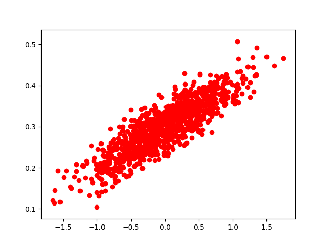

# tf-learn
51CTO 课程, 学习tensorflow, 代码管理

#### v1.3 v1.4
------------
Variable.py
>介绍tensorflow最基本的**变量**, 不同类型变量(参数)构成的tensorflow计算图, 在正式sess.run()运行前应该如何初始化

recycle-variable-add.py
>另外, 还介绍了如何用tensorflow实现一个简单的**循环加一**

session-saver.py
>保存会话. 模型保存有很多需要注意的地方, 这里只给出了最简单的例子

#### v1.5 LinerR.py
----------------
实现一个最简单的 线性回归模型
围绕一个直线上下波动，生成数据 符合正态分布的散点图，直线拟合
数据分布如图:

最终学习到的W,b无限接近0.1, 0.3 
另外, 想查看训练过程输出,参考v1.5/console.md

