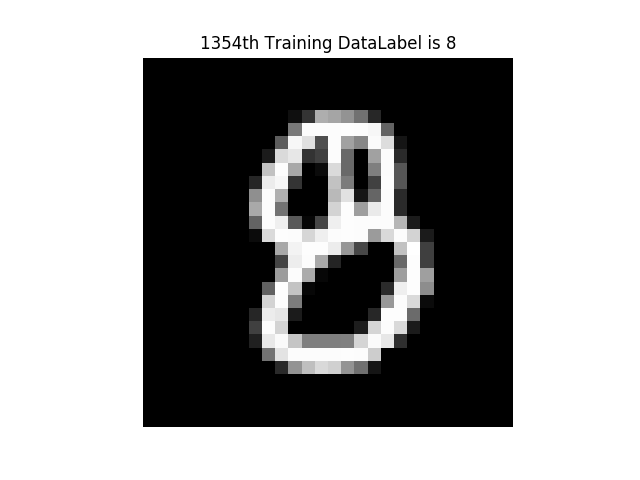

# tf-learn
51CTO 课程, 学习tensorflow, 代码管理

#### v1.3 v1.4
------------
Variable.py
>介绍tensorflow最基本的<font color=red>**变量**</font>, 不同类型变量(参数)构成的tensorflow计算图, 在正式sess.run()运行前应该如何初始化

recycle-variable-add.py
>另外, 还介绍了如何用tensorflow实现一个简单的**循环加一**

session-saver.py
>保存会话. 模型保存有很多需要注意的地方, 这里只给出了最简单的例子

#### v1.5 LinerR.py
----------------
实现一个最简单的 线性回归模型
围绕一个直线上下波动，生成数据 符合正态分布的散点图，直线拟合
数据分布如图:

最终学习到的W,b无限接近0.1, 0.3<br/>
另外, 想查看训练过程输出,参考v1.5/console.md

#### v1.6
---------------
主要讲, 如何使用tensorflow提供的封装好的方法, 自动下载并解析得到mnist, 以及如何进一步使用
提取到的图像:


注意: 使用matplotlib显示图像时, 如果不想显示坐标轴刻度,可以使用
```python
plt.axis('off') # 不显示刻度
```

#### v1.7 v1.8
------------------
实现最简单的logistic逻辑回归模型, 完成mnist数据集的分类任务

>v1.7
>>这一部分作为后面的基础, 主要还是关于 使用tensorflow封装的input_data模块, 解析得到mnist数据集中的数据, 并查看其中label中数据输出:<br/>
<pre><code>(55000, 784)
(55000, 10)
(10000, 784)
(10000, 10)
[ 0.  0.  0.  0.  0.  0.  0.  1.  0.  0.]
</code></pre>
